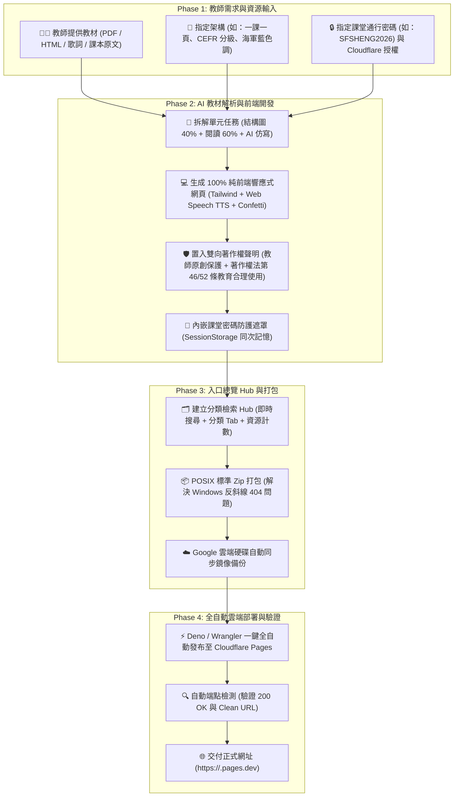

# 🏫 教學資源網頁建立與全自動部署維護技能 (Educational Resource Hub Builder & Auto-Deployment Workflow)

> 💡 **Designed & Crafted by**: **RaeHo (azureplanet-spark)** | 臺灣高中職英語教育 AI 協作專案  
> 📜 **License**: [CC BY-NC-SA 4.0](https://creativecommons.org/licenses/by-nc-sa/4.0/)（歡迎教育非商業用途引用、共備與改編，轉載請註明出處）

本 Skill 旨在規範並指導 AI Agent 與教師進行高效協作：由教師提供教學教材資源（課本單元、課文重點標註、英語歌曲、學習單、講義等）與指定架構，AI Agent 全權負責**教材模組化拆解、純前端高互動 HTML5 網頁建置、著作權與課堂密碼防護、POSIX 標準離線打包，以及 Cloudflare Pages 全自動部署上線與維護驗證**。



---

## 🧭 協作前置對話精靈 (Setup Wizard)

在啟動專案前，Agent 應主動引導教師確認以下核心參數（若教師已在提示詞中提供則直接套用）：

```text
🏫 歡迎使用「教學資源整合網頁與全自動部署」工作流！
請提供或確認以下資訊：

1. 🏷️ 【資源庫名稱與副標】：例如「Rae 的英語教學資源庫 ｜ Walk with Me: English Learning Hub」
2. 📂 【教材資源清單與檔案】：
   • 課本單元學習單（如：龍騰第三冊 L1~L9，每課包含篇章結構圖、閱讀測驗、AI 句型仿寫）
   • 課文重點精讀標註（如：B3U1-3, B3U4-6, B3U7-9 互動 HTML）
   • 課外英語歌曲學習單（如：《Rude》A1~A2、《Speechless》B1~B2）
3. 📐 【架構偏好】：
   • 課本學習單是否採「一課一頁獨立 HTML」（強烈推薦：便於 Google Classroom 單課發布）
4. 🎨 【視覺風格與色調】：
   • 主題色系（推薦海軍藍 Deep Navy `#0B132B` 搭配琥珀金、天藍或紫羅蘭點綴）
   • 是否需要教師形象圖片（若無原創授權圖片，建議採用極簡幾何徽章風格，不放 AI 生成頭像）
5. 🔒 【課堂密碼防護需求】：
   • 是否對特定教材（如歌曲影音）設定校園限定通行密碼？（例如：SFSHENG2026）
6. 🚀 【Cloudflare Pages 自動部署授權】：
   • Account ID（32 位英數代碼）
   • API Token（具備 Cloudflare Pages: Edit 權限）
   • 專案名稱（Slug，例如：`rae-english-hub`）
```

---

## 🛠️ 教學資源網頁核心建置標準

### 1. 課本單元學習單架構（一課一頁黃金標準）
每一課（`lesson1.html` ~ `lesson9.html`）皆為獨立完整的單一網頁，架構包含：
- **頂部導覽列**：上一課／下一課快速跳轉、返回總覽 Hub 按鈕、即時作答計時器。
- **Mission 1: 篇章結構圖 (Structure Map 40 分)**：
  - 4 個關鍵核心單字挖空（行內即時驗證、即時給分）。
- **Mission 2: 閱讀理解實戰 (Reading Comprehension 60 分)**：
  - 3 題大考題型單選題（細節理解、文意推論、主旨大意，每題 20 分）。
- **Mission 3: AI 句型仿寫鷹架 (AI Sentence Building)**：
  - 核心大考句型公式、課文原句示範、仿寫題目與參考解答展開。
- **即時結算與滿分動態回饋**：
  - 點擊「即時批改結算」計算總分（滿分 100 分），達 80 分以上噴發全彩 Confetti 彩帶，低於 60 分觸發防呆提醒。

### 2. 雙向著作權保護與教育合理使用宣告
全站總覽首頁與各分頁頁尾必須具備嚴謹的雙重聲明：
```html
<section id="copyright-section" class="rounded-3xl p-6 bg-[#0B132B] text-slate-200 space-y-4 border border-blue-950">
  <div class="flex items-center gap-2 font-bold text-amber-300 text-sm border-b border-slate-800 pb-3">
    <i class="fa-solid fa-shield-halved"></i>
    <span>著作權歸屬與教育合理使用聲明 (Copyright & Fair Use Notice)</span>
  </div>
  <div class="grid grid-cols-1 md:grid-cols-2 gap-4 text-xs leading-relaxed text-slate-300">
    <div class="bg-[#1C2541]/70 p-4 rounded-2xl border border-slate-700/60">
      <h4 class="font-bold text-white flex items-center gap-1.5"><span class="text-sky-400">🛡️</span> 教師個人原創著作權益保護</h4>
      <p>本教材整體架構、單元任務、題目編排、學習鷹架與視覺設計，著作權均完整為<strong>國立新豐高中英文科 何瑞雲老師 (RaeHo)</strong> 所有。歡迎教育非商業教學引用，轉載請註明出處。</p>
    </div>
    <div class="bg-[#1C2541]/70 p-4 rounded-2xl border border-slate-700/60">
      <h4 class="font-bold text-white flex items-center gap-1.5"><span class="text-amber-400">⚖️</span> 學校教育目的非營利合理使用</h4>
      <p>本站所引用之流行音樂、官方影音、歌詞文本與教科書原文，版權均完整歸屬於原著作權人、唱片公司與出版商所有。本站依據<strong>臺灣著作權法第 46 條及第 52 條</strong>之教學合理使用範疇建置。</p>
    </div>
  </div>
  <div class="flex flex-wrap items-center justify-between text-[11px] text-slate-400 pt-2 border-t border-slate-800">
    <span>📌 授權條款：創用 CC 姓名標示—非商業性—相同方式分享 (CC BY-NC-SA 4.0)</span>
    <span>© 2026 何瑞雲 (RaeHo) ｜ Walk with Me</span>
  </div>
</section>
```

### 3. 校園課堂通行密碼防護鎖 (Classroom Password Gate)
若特定內容（如流行音樂影音學習單）需避免公開傳播以強化合規性，應內嵌前端通行密碼機制：
- 預設通行碼（如 `SFSHENG2026`）。
- 未解鎖前：`body` 加上 `overflow-hidden`，全螢幕高斯模糊（`backdrop-blur-xl`）遮罩覆蓋。
- 輸入正確密碼：寫入 `sessionStorage.setItem('sfsh_song_auth', 'true')`，同瀏覽器分頁切換或刷新時免重複輸入。
- 支援眼睛圖示切換明文/密文，並附帶一鍵「回到總覽首頁」連結。

---

## 📦 打包與自動部署標準 SOP

### Step 1: 本地目錄結構規範 (POSIX Compliant)
```text
project-root/
├── index.html                      # 總覽 Hub 首頁
├── assets/                         # 圖片、Logo 等靜態資源
├── textbook/
│   └── b3/
│       ├── worksheets/
│       │   ├── index.html          # 九大單元導覽 Hub
│       │   ├── lesson1.html        # L1 獨立學習單
│       │   └── ... lesson9.html    # L9 獨立學習單
│       └── annotations/
│           ├── b3u1-3.html         # U1~3 課文精讀標註
│           ├── b3u4-6.html         # U4~6 課文精讀標註
│           └── b3u7-9.html         # U7~9 課文精讀標註
└── songs/
    ├── a1-a2/
    │   ├── rude/index.html         # 密碼保護歌曲學習單
    │   └── perfect-strangers/index.html
    └── b1-b2/
        └── speechless/index.html   # 密碼保護歌曲學習單
```

### Step 2: 解決 Windows 反斜線 404 災難（標準 POSIX Zip 壓縮腳本）
> ⚠️ **重要踩坑防護**：Windows 內建的 `Compress-Archive` 會使用 Windows 反斜線 `\` 記錄壓縮檔內路徑，導致上傳至 Linux 架構的 Cloudflare Pages 時被識別為扁平單一檔名而產生 404 錯誤！
> **必須採用 .NET ZipArchive 或將路徑全部轉換為正斜線 `/`**：

```powershell
Add-Type -AssemblyName System.IO.Compression.FileSystem
$src = "C:\path\to\project-root"
$zipOut = "H:\我的雲端硬碟\English song worksheets\project_site.zip"
if (Test-Path $zipOut) { Remove-Item $zipOut -Force }
[System.IO.Compression.ZipFile]::CreateFromDirectory($src, $zipOut)
```

### Step 3: Cloudflare Pages 全自動部署指令
透過已安裝的 `deno` 直接執行 `wrangler`，在 Windows/Mac 上均無需全局安裝 Node.js：

```powershell
$env:CLOUDFLARE_API_TOKEN = "<API_TOKEN>"
$env:CLOUDFLARE_ACCOUNT_ID = "<ACCOUNT_ID>"
deno run -A npm:wrangler pages deploy "C:\path\to\project-root" --project-name "<PROJECT_NAME>" --branch "main" --commit-dirty=true
```

### Step 4: 上線後自動端點檢測 (Post-Deployment Verification)
部署完成後，Agent 必須自動向所有重要子頁面發送 HEAD / GET 請求，確認全數回傳 `200 OK`：
```powershell
$urls = @(
    "https://<project>.pages.dev/",
    "https://<project>.pages.dev/textbook/b3/worksheets/",
    "https://<project>.pages.dev/textbook/b3/worksheets/lesson1",
    "https://<project>.pages.dev/songs/a1-a2/rude/"
)
foreach ($u in $urls) {
    $res = Invoke-WebRequest -Uri $u -Method Head -UseBasicParsing -MaximumRedirection 5
    Write-Host "$($res.StatusCode) OK: $u"
}
```

---

## 🛡️ 資安與敏感資訊處理原則

1. **零硬編碼與排除同步**：
   - `CLOUDFLARE_API_TOKEN` 僅在當前會話 (Session) 或行程 (Process) 環境變數中調用。
   - 嚴禁將包含 Token、Key 的檔案提交至 Git、chezmoi 或公開倉庫。
2. **最小權限原則**：
   - 僅要求 Cloudflare `Cloudflare Pages: Edit` 權限之 API 代碼，嚴禁索取全域 Global API Key。
3. **雲端硬碟鏡像備份**：
   - 每次變更皆同步備份至教師指定的 Google 雲端硬碟目錄（如 `H:\我的雲端硬碟\English song worksheets\`），確保資料永不丟失。

---

## 🔄 日常維護與增量更新指南

當教師後續提出「新增第十課」、「修改某題答案」、「替換歌曲影片」或「更改密碼」時：
1. **定位目標檔案**：精準修改對應之 `lessonX.html` 或 `index.html`。
2. **同步更新總覽 Hub**：在 `index.html` 的 `resourcesData` 陣列中更新或追加項目。
3. **重新打包與一鍵推送**：重新生成 `_site.zip` 並執行 Deno Wrangler 增量推送（Cloudflare 會自動比對差異 Hash，僅上傳變更檔案，秒速完成更新）。
4. **回報正式網址與變更摘要**。
